# ionic-tasks

Aplicación de gestión de tareas construida con **Ionic 8** y **Angular 20**, con soporte para despliegue nativo en Android e iOS mediante Cordova, e integración con **Firebase Remote Config** para control dinámico de funcionalidades.

---

## Tabla de contenidos

1. [Funcionalidades](#funcionalidades)
2. [Demo en video](#demo-en-video)
3. [Capturas de pantalla](#capturas-de-pantalla)
4. [Requisitos previos](#requisitos-previos)
5. [Instalación y ejecución en desarrollo](#instalación-y-ejecución-en-desarrollo)
6. [Compilar para Android](#compilar-para-android)
7. [Compilar para iOS](#compilar-para-ios)
8. [Estructura del proyecto](#estructura-del-proyecto)
9. [Firebase Remote Config](#firebase-remote-config)
10. [Preguntas técnicas](#preguntas-técnicas)

---

## Funcionalidades

| Módulo            | Descripción                                                            |
| ----------------- | ---------------------------------------------------------------------- |
| **Tareas**        | Crear, completar y eliminar tareas; filtrar por categoría              |
| **Categorías**    | Crear, editar y eliminar categorías con color asignado automáticamente |
| **Estadísticas**  | Tarjeta con total, completadas, pendientes y porcentaje de avance      |
| **Feature Flags** | Control de visibilidad de funcionalidades vía Firebase Remote Config   |
| **Persistencia**  | Datos guardados en `localStorage`; no requiere backend                 |

---

## Demo en video

<div align="center">
  <b>Recorrido completo de la aplicación</b>
  <br/><br/>
  <video src="src/assets/video/recording-ionic-tasks.mp4" controls width="320" style="border-radius: 12px;"></video>
</div>

---

## Capturas de pantalla

### Vistas principales

<table>
  <tr>
    <td align="center"><b>Tareas</b></td>
    <td align="center"><b>Categorías</b></td>
    <td align="center"><b>Configuración</b></td>
  </tr>
  <tr>
    <td>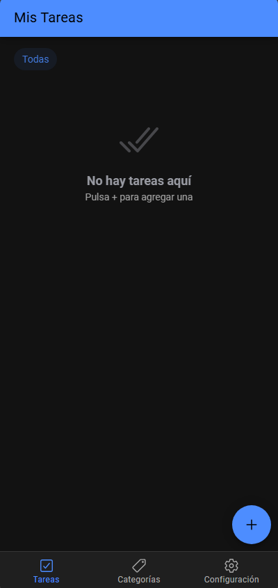</td>
    <td>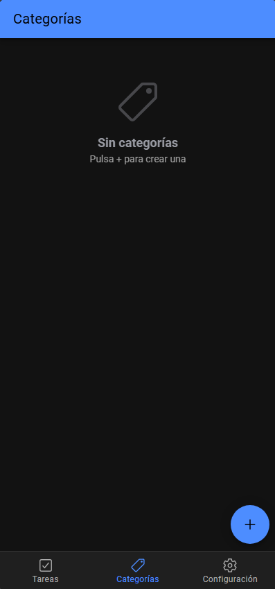</td>
    <td>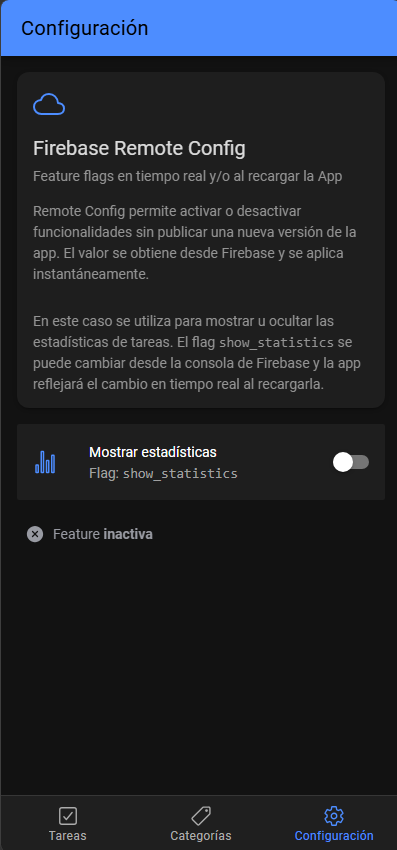</td>
  </tr>
</table>

---

### Gestión de tareas

<table>
  <tr>
    <td align="center"><b>Crear tarea (1)</b></td>
    <td align="center"><b>Crear tarea (2)</b></td>
    <td align="center"><b>Eliminar tarea</b></td>
  </tr>
  <tr>
    <td>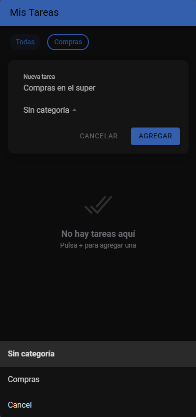</td>
    <td>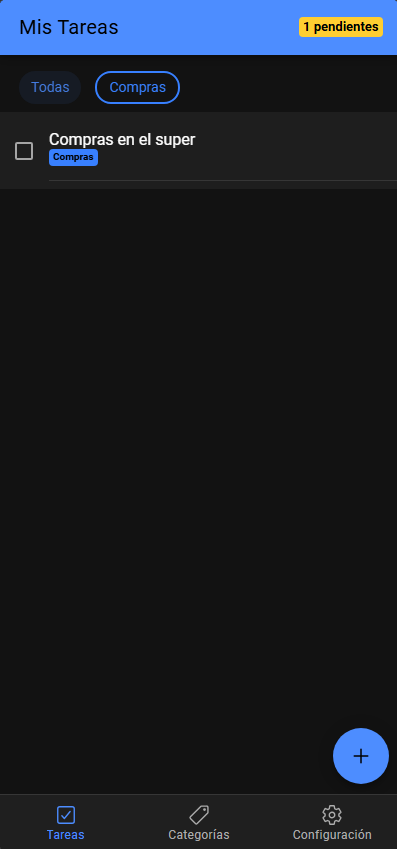</td>
    <td>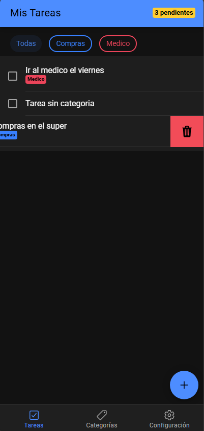</td>
  </tr>
  <tr>
    <td align="center"><b>Filtros por defecto</b></td>
    <td align="center"><b>Filtrar por categoría</b></td>
    <td></td>
  </tr>
  <tr>
    <td>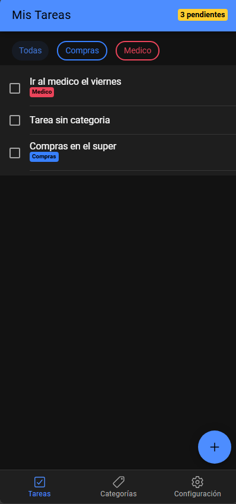</td>
    <td>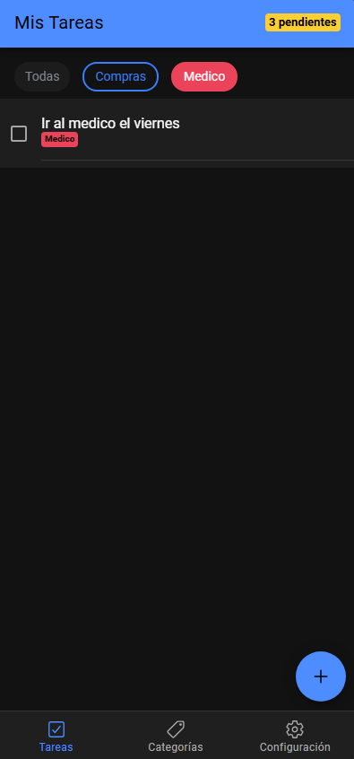</td>
    <td></td>
  </tr>
</table>

---

### Gestión de categorías

<table>
  <tr>
    <td align="center"><b>Crear categoría (1)</b></td>
    <td align="center"><b>Crear categoría (2)</b></td>
    <td align="center"><b>Eliminar categoría</b></td>
  </tr>
  <tr>
    <td>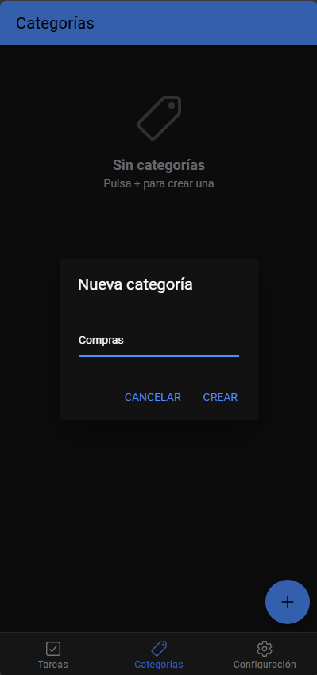</td>
    <td>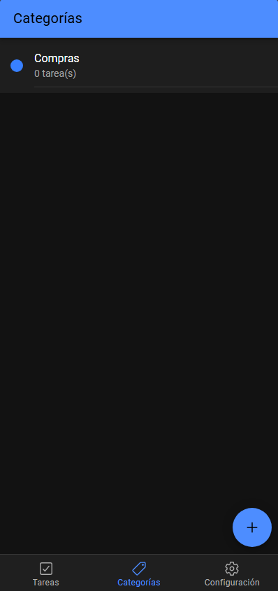</td>
    <td>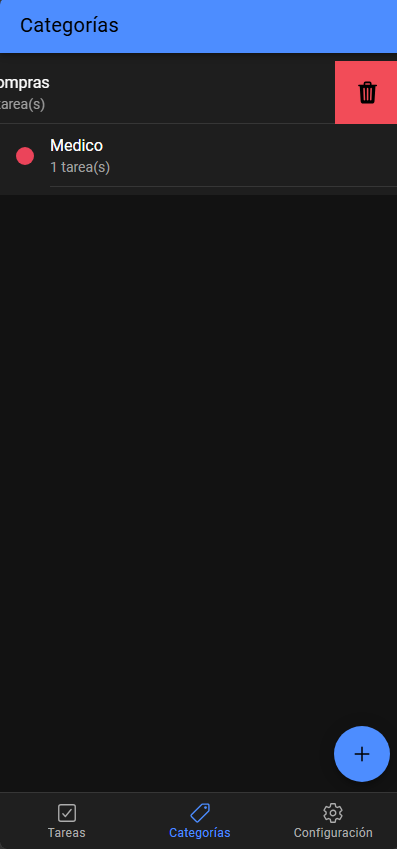</td>
  </tr>
  <tr>
    <td align="center"><b>Editar categoría (1)</b></td>
    <td align="center"><b>Editar categoría (2)</b></td>
    <td></td>
  </tr>
  <tr>
    <td>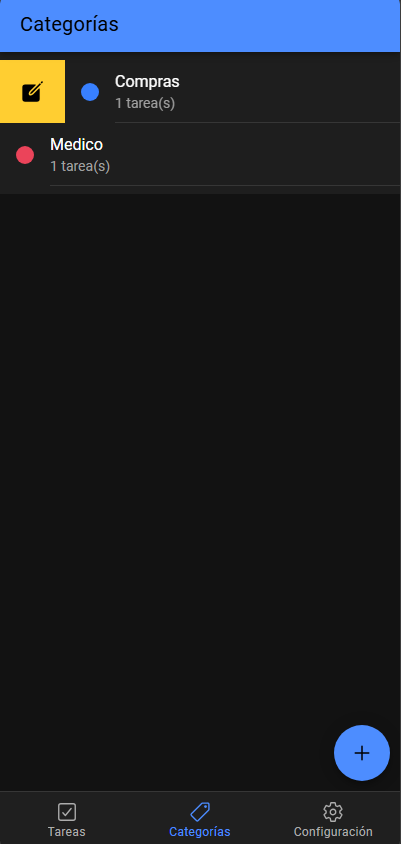</td>
    <td>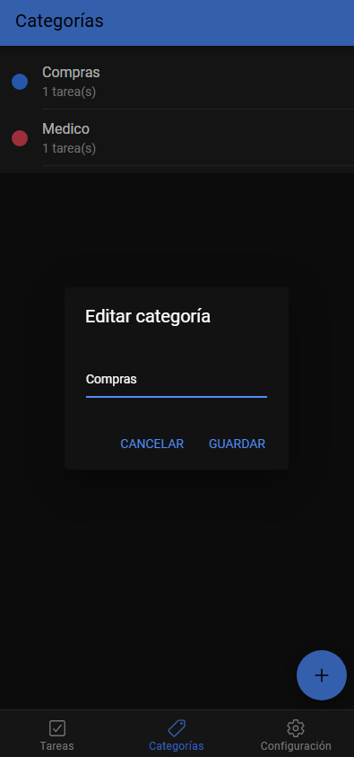</td>
    <td></td>
  </tr>
</table>

---

### Firebase Remote Config — Feature flags

<table>
  <tr>
    <td align="center"><b>Estado inicial en Firebase</b></td>
    <td align="center"><b>Editar flag (1)</b></td>
    <td align="center"><b>Editar flag (2)</b></td>
  </tr>
  <tr>
    <td>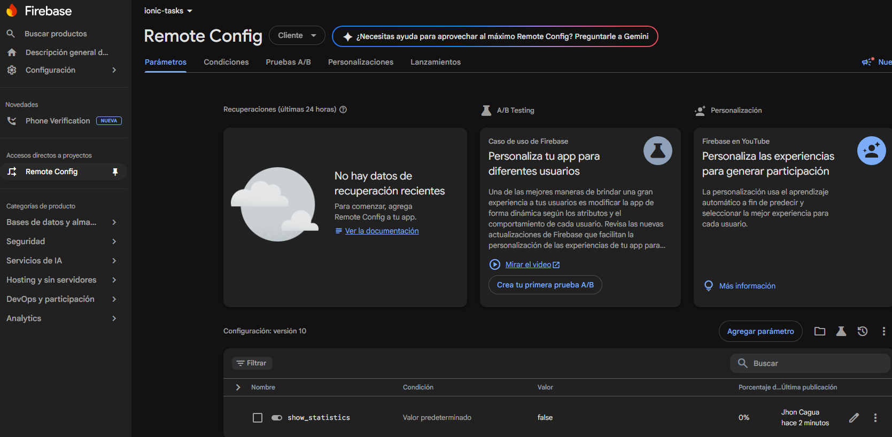</td>
    <td>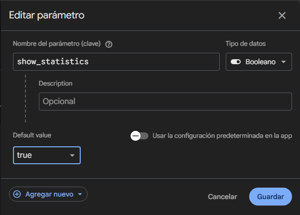</td>
    <td>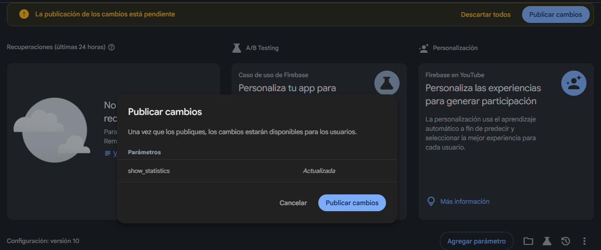</td>
  </tr>
  <tr>
    <td align="center"><b>Configuración actualizada</b></td>
    <td></td>
    <td></td>
  </tr>
  <tr>
    <td>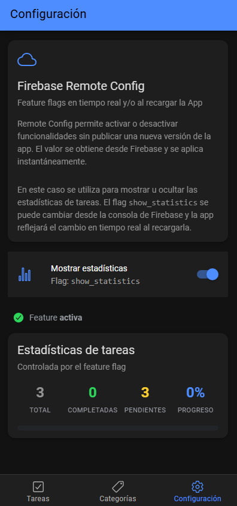</td>
    <td></td>
    <td></td>
  </tr>
</table>

---

## Requisitos previos

| Herramienta    | Versión mínima       | Verificar         |
| -------------- | -------------------- | ----------------- |
| Node.js        | 18+                  | `node -v`         |
| npm            | 9+                   | `npm -v`          |
| Angular CLI    | 20                   | `ng version`      |
| Ionic CLI      | 7+                   | `ionic -v`        |
| Cordova CLI    | 12+                  | `cordova -v`      |
| Java JDK       | 17+ (Android)        | `java -version`   |
| Android Studio | Hedgehog+            | —                 |
| Xcode          | 15+ (solo macOS/iOS) | `xcode-select -v` |

---

## Instalación y ejecución en desarrollo

```bash
# 1. Clonar el repositorio
git clone https://github.com/sebas-config-s/ionic-cordova-interview-n.git
cd ionic-tasks

# 2. Instalar dependencias
npm install

# 3. Ejecutar en el navegador (modo desarrollo)
ionic serve
# http://localhost:8100
```

### Scripts disponibles

| Comando       | Descripción                                |
| ------------- | ------------------------------------------ |
| `ionic serve` | Servidor de desarrollo en `localhost:8100` |

---

## Compilar para Android

### Preparación del entorno

1. Instalar **Android Studio** y configurar el SDK de Android.
2. Definir la variable de entorno `ANDROID_HOME`:

```bash
# Windows (PowerShell)
$env:ANDROID_HOME = "C:\Users\<tu-usuario>\AppData\Local\Android\Sdk"
$env:PATH += ";$env:ANDROID_HOME\platform-tools;$env:ANDROID_HOME\tools"
```

3. Aceptar las licencias del SDK:

```bash
sdkmanager --licenses
```

### Compilar y ejecutar

```bash
# 1. Build de producción de la web
npm run build

# 2. Agregar la plataforma Android (solo la primera vez)
ionic cordova platform add android

# 3. Ejecutar en emulador Android
ionic cordova emulate android

# 4. Ejecutar en dispositivo físico (USB debugging activado)
ionic cordova run android --device

# 5. Generar APK de producción
ionic cordova build android --prod --release
# → El APK queda en: platforms/android/app/build/outputs/apk/release/
```

> **Nota:** Si usas un emulador, asegúrate de tener creado un AVD (Android Virtual Device) desde Android Studio > Device Manager.

---

## Compilar para iOS

> Requiere **macOS** con Xcode instalado.

### Preparación del entorno

```bash
# Instalar herramientas de línea de comandos de Xcode
xcode-select --install

# Instalar ios-deploy para despliegue en dispositivo físico
npm install -g ios-deploy

# Instalar CocoaPods (gestión de dependencias iOS)
sudo gem install cocoapods
```

### Compilar y ejecutar

```bash
# 1. Build de producción de la web
npm run build

# 2. Agregar la plataforma iOS (solo la primera vez)
ionic cordova platform add ios

# 3. Instalar dependencias de CocoaPods
cd platforms/ios && pod install && cd ../..

# 4. Ejecutar en simulador iOS
ionic cordova emulate ios

# 5. Ejecutar en dispositivo físico
ionic cordova run ios --device

# 6. Abrir en Xcode para firma y distribución
open platforms/ios/ionic-tasks.xcworkspace
```

> **Nota:** Para ejecutar en un dispositivo físico iOS es necesario contar con una cuenta de Apple Developer y configurar el signing en Xcode.

---

## Estructura del proyecto

```
ionic-tasks/
├── src/
│   ├── app/
│   │   ├── core/
│   │   │   ├── constants/          # Claves de localStorage
│   │   │   └── services/
│   │   │       └── remote-config.service.ts  # Firebase feature flags
│   │   │
│   │   ├── features/
│   │   │   ├── tasks/              # Módulo de tareas
│   │   │   │   ├── models/
│   │   │   │   ├── pages/
│   │   │   │   └── services/
│   │   │   ├── categories/         # Módulo de categorías
│   │   │   │   ├── models/
│   │   │   │   ├── pages/
│   │   │   │   └── services/
│   │   │   └── settings/           # Configuración y feature flags
│   │   │
│   │   ├── layout/
│   │   │   └── tabs-layout/        # Shell con tabs de navegación
│   │   │
│   │   └── shared/                 # Componentes reutilizables
│   │
│   └── environments/
│       ├── environment.ts          # Configuración de desarrollo
│       └── environment.prod.ts     # Configuración de producción
│
├── config.xml                      # Configuración Cordova (íconos, plugins)
├── angular.json
├── ionic.config.json
└── package.json
```

**Patrones de diseño:**

- Arquitectura standalone (Angular 14+, sin NgModules)
- Feature-based organization con lazy loading
- Estado reactivo con Angular Signals
- Path aliases: `@core/*` y `@features/*`

---

## Firebase Remote Config

La aplicación usa Firebase Remote Config para controlar funcionalidades en tiempo real sin necesidad de publicar una nueva versión.

### Feature flags disponibles

| Parámetro en Firebase | Tipo      | Efecto                                                          |
| --------------------- | --------- | --------------------------------------------------------------- |
| `show_statistics`     | `boolean` | Muestra/oculta la tarjeta de estadísticas en la vista de Tareas |

---

## Preguntas técnicas

### ¿Cuáles fueron los principales desafíos al implementar las nuevas funcionalidades?

**1. Integración de Firebase Remote Config con Angular Signals**
El mayor desafío fue sincronizar el ciclo de vida asíncrono de Firebase con el sistema reactivo de Signals de Angular. Firebase `fetchAndActivate()` devuelve una `Promise`, mientras que los componentes esperan valores síncronos en el primer render. Se resolvió inicializando el flag con el valor por defecto (`showStatistics: false`) y actualizando el signal tras completarse la promesa, evitando parpadeos en la UI.

**2. Lazy loading con standalone components**
Migrar a arquitectura standalone eliminó los NgModules pero exigió configurar correctamente el tree-shaking y el lazy loading a nivel de rutas usando `loadComponent`. Esto requirió asegurarse de que los providers (como `RemoteConfigService`) estuviesen disponibles globalmente con `providedIn: 'root'` y no sólo en el módulo de features.

**3. Persistencia entre sesiones sin backend**
Diseñar la capa de datos usando solo `localStorage` implicó manejar la serialización/deserialización de objetos y garantizar consistencia al eliminar una categoría (las tareas asociadas debían desvincularse automáticamente).

---

### ¿Qué técnicas de optimización de rendimiento aplicaste y por qué?

**Angular Signals en lugar de BehaviorSubject**
Se usaron Signals para el estado de tareas, categorías y feature flags. Los Signals son síncronos, permiten detección de cambios granular y reducen el boilerplate frente a RxJS cuando no se necesita operadores de transformación.

**Lazy loading de rutas**
Cada módulo (tareas, categorías, configuración) se carga de forma diferida con `loadComponent`. El bundle inicial solo incluye el shell de tabs, reduciendo el tiempo de primera carga (TTI).

**OnPush implícito con Signals**
Los componentes standalone que consumen Signals se benefician de la estrategia de detección de cambios más eficiente de Angular, ya que el framework sabe exactamente qué signal cambió y solo re-renderiza el árbol afectado.

**Memoización con `computed()`**
Las estadísticas (total, completadas, pendientes, porcentaje) se derivan con `computed()` desde el signal de tareas. El cálculo solo se re-ejecuta cuando cambia la lista de tareas, no en cada render.

---

### ¿Cómo aseguraste la calidad y mantenibilidad del código?

**Separación de responsabilidades**

- Servicios manejan el estado y la lógica de negocio
- Los componentes solo se encargan de presentar datos y capturar eventos del usuario
- Las constantes (`storage-keys.ts`) centralizan las claves de `localStorage`, evitando magic strings dispersos

**Arquitectura feature-based**
Cada funcionalidad (tareas, categorías, configuración) es un módulo autocontenido con su propio modelo, servicio y página. Esto facilita el trabajo en equipo y la incorporación de nuevos desarrolladores.

**TypeScript estricto**
El proyecto usa `strict: true` en `tsconfig.json`, lo que obliga a tipar correctamente todas las variables, parámetros y retornos de función, reduciendo bugs en tiempo de ejecución.

**ESLint configurado**
Se usa `@angular-eslint` con reglas para detectar patrones anti-performance (suscripciones no canceladas, uso incorrecto del ciclo de vida) y mantener consistencia de estilo.

**Separación de entornos**
Las credenciales de Firebase de producción se inyectan mediante variables de entorno en el build, evitando exponer claves en el repositorio.
